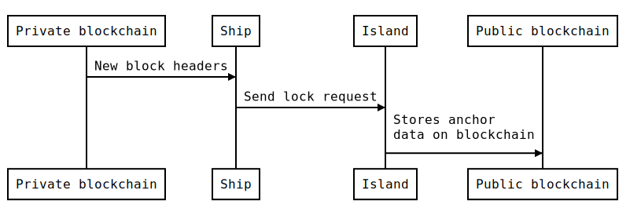
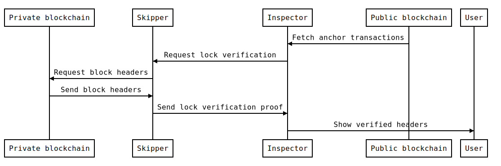
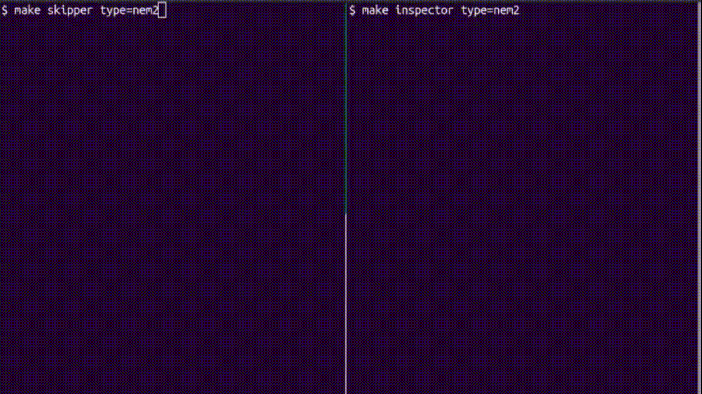

# LuxTag Chain Anchoring Service

<p align="center">
  
</p>

The goal of chain anchoring is to secure the data integrity of a smaller private chain to a larger public chain for audibility without the high cost of transactions on a public chain.

Private chains provide the ability to scale number of transactions, lowering the cost per transaction and protects the privacy of the data. Public chains are more resilient to manipulation, where every transactions are validated.

The use of blockchain is mainly to show two things:

  1. That the data exists at a certain point of time; and
  2. That the data did not change after that point of time.

> Placing all transactions on a public blockchain will guarantee that every single transaction existed at a certain point of time and did not change after that time. However, in most cases it is sufficient to show prove that data up to a certain point of time (at the time of anchoring) is valid and did not change.

## Anchoring

For anchoring, we will designate the public blockchain as **islands** and the private blockchain as **ships**.

### Sequence diagram



## Verifying

Verification service will run in two parts, an **inspector** service that generates a list of block headers stored on the public blockchain, and a **skipper** that fetches block headers from the private blockchain for the inspector to verify.

### Sequence diagram



## Quick start

### Prerequisites
```sh
# Copy `.env.example` to `.env`
cp .env.example .env

# Install dependencies
make install

# Update .proto files
make proto
```

### Running anchoring service

Set correct environment variables in `.env`

Start the target island:
```
make island target=nem2
```

Followed by the appropriate ship:
```
make ship target=nem2
```

Example:


### Running verifier service

Set correct environment variables in `.env`

Start the skipper:
```
make skipper target=nem2
```

Start the inspector:
```
make inspector target=nem2
```

Example:


## How to build

For details on how to build this project see [HOW-TO-BUILD.md](./HOW-TO-BUILD.md)

## Contributing

If there is a blockchain implementation that is missing feel free to submit an issue or a PR (even better!). You can use the implementations here as a baseline.
